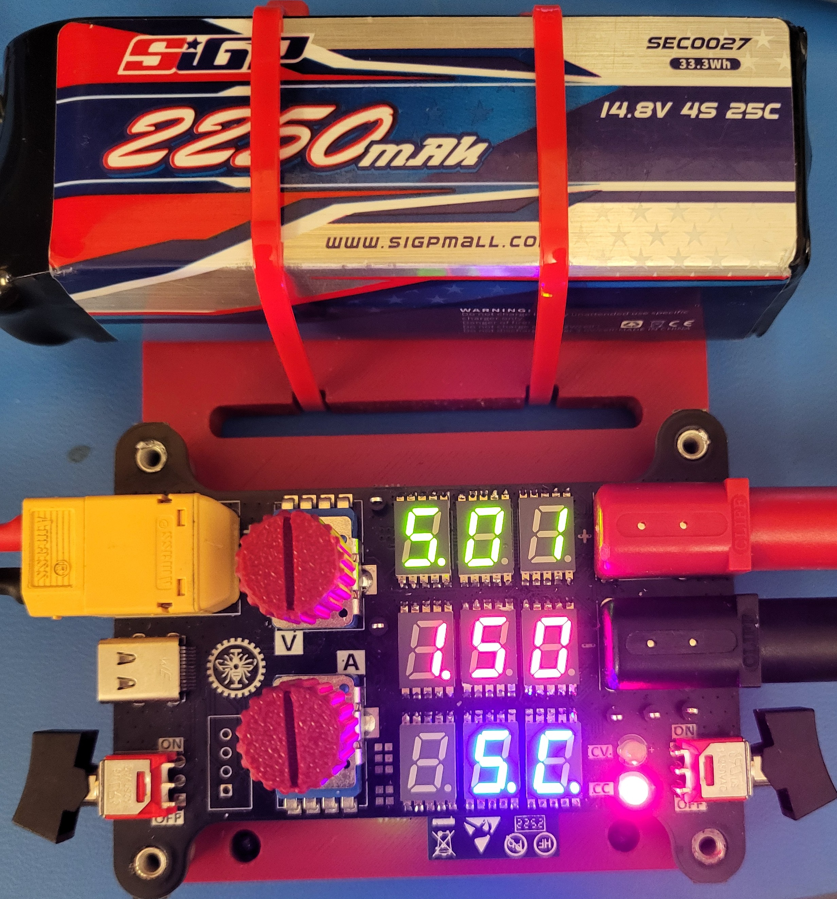
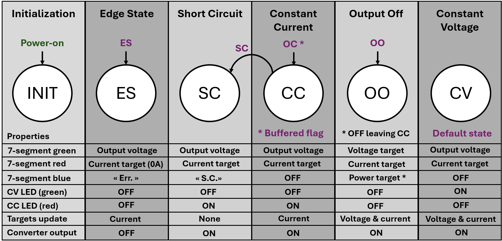

# Portable-Programmable-DC-Power-Supply
A portable version of a DC adjustable bench supply that uses a lithium-ion battery with intuitive user controls and displays on the PCB surface.

  
  &nbsp;&nbsp;
  

# Project overview

This project was completed as part of Polytechnique Montréal's _ELE3000_ course, a third-year individual engineering project. The objective was to design a portable programmable DC power supply with specifications comparable to a conventional laboratory bench supply. While traditional bench supplies are typically bulky and require an AC power source, this project explores an alternative approach based on a rechargeable lithium-ion battery and a custom-designed PCB.

The project involved three main stages:
- Designing of a 4-layer PCB using _Altium Designer_;
- Developing a custom support structure in _SolidWorks_ for 3D printing;
- Writing the embedded firmware for the _ESP32_ microcontroller responsible for system control and user interaction;

  
  &nbsp;&nbsp;
  
  &nbsp;&nbsp;
  

This project allowed me to further develop my PCB design skills (following my previous [Robot PCB project](https://github.com/justinlalonde/MachinePM---Robot-PCB/tree/main)) while gaining experience in power electronics design. In particular, it taught me the trade-offs between miniaturization, thermal management, and functionality when designing high-power embedded systems. 

The project concluded with a technical presentation and demonstration to professors and industry evaluators. The poster used during the presentation is available under the [Documentation](https://github.com/justinlalonde/Portable-Programmable-DC-Power-Supply/tree/004b28a5eb4e6ffac3d20e264f36d698339840a9/Documentation) folder (poster in French).

# Key features
Here are some key features and specs related to this project:
- 9.6V to 21.0V DC input voltage (3S or 4S lithium-ion batteries);
- 3V to 20V DC output voltage;
- 3A max output current for 60W peak operation;
- Overvoltage, undervoltage, reverse polarity, and inrush current input protections ([LM74800](https://www.ti.com/lit/ds/symlink/lm7480-q1.pdf));
- Input on/off switching with a rocker switch;
- 80% global power efficiency at high loads in step-down (buck) operation;
- 90% global power efficiency at high loads in step-up (boost) operation;
- Reverse current, overcurrent, and short-circuit output protections ([TPS259470](https://www.ti.com/lit/ds/symlink/tps25947.pdf));
- User-adjustable voltage and current limit targets with potentiometers;
- DC-DC conversion scheme with constant voltage or constant current operation depending on the user-programmed current limit and load;
- Output on/off switching with a rocker switch;
- 7-segment displays for voltage, current, and power with dedicated LED driver IC's ([LP5024](https://www.ti.com/lit/ds/symlink/lp5024.pdf));
- Red and green LEDs indicate normal constant voltage operation and fault-enabled constant current operation;
- The system detects and indicates output short-circuits by displaying "_S.C._" on the blue row of displays (see image below);

  
  &nbsp;&nbsp;
  

# Hardware architecture
The central feature of this project is the DC-DC conversion happening with the [TPS55287](https://www.ti.com/lit/ds/symlink/tps55287.pdf), which is a _4-A Buck-Boost Converter with I2C Interface IC_ from _Texas Instruments_. This IC converts the input battery voltage to a wide output range using either step-up or step-down operation. This main voltage conversion IC is one amongst the 11 subcircuits, which are identified with their schematic sheet names in the following image.

  

**POWER STAGES**:
1. The input voltage from the connected DC power supply (battery) first goes through an input protection / switching stage. This input stage implements undervoltage and overvoltage lockout protections, inrush current limiting, and enables the rocker switch to disable the supply to the rest of the board ([LM74800](https://www.ti.com/lit/ds/symlink/lm7480-q1.pdf?HQS=dis-dk-null-digikeymode-dsf-pf-null-wwe&ts=1783800356800)).
2. The input voltage is then directed to an independent 5V buck converter [LMR51450](https://www.ti.com/lit/ds/symlink/lmr51440.pdf), as well as the main buck-boost converter ([TPS55287](https://www.ti.com/lit/ds/symlink/tps55287.pdf)) which converts it to an arbitrary, user-selected DC voltage target from 3V to 20V.
3. The 5V that is generated from the independent buck converter is multiplexed with the bus voltage of the USB-C device port using a power multiplexer IC ([TPS2115](https://www.ti.com/lit/ds/symlink/tps2115.pdf?ts=1783787434649&ref_url=https%253A%252F%252Fwww.ti.com%252Fproduct%252FTPS2115)) before being regulated to 3.3V ([TLV76733](https://www.ti.com/lit/ds/symlink/tlv767.pdf?ts=1783784618184)) to power many ICs present on the board, more importantly the _ESP32_ module itself. This power multiplexing is to ensure that the _ESP32_ microcontroller can be programmed with only a USB-C connection without needing the presence of the main power source.
4. On the other hand, the output voltage that is generated from the buck-boost converter then goes through an output protection / switching stage ([TPS259470](https://www.ti.com/lit/ds/symlink/tps25947.pdf)). This stage implements an E-Fuse integrated circuit, which has output current limiting, short-circuit protection and detection, undervoltage lockout, overvoltage lockout, and reverse current protection. This stage enables the rocker switch on the output side to enable and disable the output supply completely.

**DIGITAL ICs**:
1. Serial communication with the _ESP32_ requires a _USB-To-UART_ bridge IC ([CP2102N](https://www.silabs.com/documents/public/data-sheets/cp2102n-datasheet.pdf)).
2. Two Analogue-to-Digital Converter (ADC) ICs are also present on the board to read power rail voltages, the user potentiometer centre taps, and some other analogue signals generated by various ICs ([ADS1015](https://www.ti.com/lit/ds/symlink/ads1013.pdf?HQS=dis-dk-null-digikeymode-dsf-pf-null-wwe&ts=1783787787332&ref_url=https%253A%252F%252Fwww.ti.com%252Fgeneral%252Fdocs%252Fsuppproductinfo.tsp%253FdistId%253D10%2526gotoUrl%253Dhttps%253A%252F%252Fwww.ti.com%252Flit%252Fgpn%252Fads1013)).
3. The nine 7-segment displays present on the PCB's top side are driven by three LED driver ICs, each capable of driving 24 discrete LEDs ([LP5024](https://www.ti.com/lit/ds/symlink/lp5024.pdf)).

The different integrated circuits present on the board communicate via I2C. The following image shows the I2C bus as it is routed on the PCB.

  

# Output fault response
Between the adjustable buck-boost converter IC and the output protection / switching stage IC, many built-in protections are implemented thanks to the two involved integrated circuits. However, during an output short-circuit, both the buck-boost converter ([TPS55287](https://www.ti.com/lit/ds/symlink/tps55287.pdf)) and the output E-Fuse IC implement their own built-in protections ([TPS259470](https://www.ti.com/lit/ds/symlink/tps25947.pdf)) to respond to this fault. This can cause issues as the two ICs, placed successively to one another, both try to trigger their responses. The solution to this was to disable some of the buck-boost converter's protections and program the E-Fuse's protection timing and voltage thresholds appropriately to ensure compatibility between these two power ICs. 

By placing carefully selected capacitors and resistors on the [TPS259470](https://www.ti.com/lit/ds/symlink/tps25947.pdf)'s pins, timing and voltage protection thresholds were programmed in a way that both ICs would trigger successively depending on the severity of a given overcurrent event instead of simultaneously, whether it be a controlled overcurrent or a short circuit. The following graph shows which protection from which IC will be triggered and take over depending on the duration and magnitude of an overcurrent event.

  

# Firmware
Just short of 1000 total lines of C code were written to the _ESP32_ for this project's firmware using the _ESP Integrated Development Framework_ (ESP-IDF), which can easily be set up with a _Visual Studio Code_ extension. The source code can be found under the [Firmware](https://github.com/justinlalonde/Portable-Programmable-DC-Power-Supply/tree/d0015435451c163994e33e4b49d970070d409dda/Firmware) folder and the ESP-IDF project can also be downloaded with the [ESP-IDF Project.zip](https://github.com/justinlalonde/Portable-Programmable-DC-Power-Supply/tree/main) file. 
Essentially, what the _ESP32_ does during board execution is run a state machine cycle every 50ms. Each cycle, the _ESP32_ reads four flags. These flags represent the state of the hardware, which is polled from IC registers via I2C or by the GPIO states of the _ESP32_. These flags and the present state of the state machine determine which next state should be selected. The following table shows these four flags and their hardware definitions.

  

The following table shows all states of the state machine and how they relate to each other. Note that a vast part of the hardware and voltage conversion circuitry operates independently from the _ESP32_, as the microcontroller is mainly there for managing the user potentiometer reads, the 7-segment displays, and giving a voltage target to the buck-boost conversion chip. The switching of the input and output supply with the rocker switches and the input and output protection circuitry were designed to be completely independent from the microcontroller for hardware integrity purposes.

  

# Testing
After the PCB assembly and basic functional tests followed a thorough testing phase of the project's thermal performance and energy efficiency. The following screenshot of a thermal camera shows the bottom side of the PCB as it is operating near its maximum output power of 60W (20V output at 3A load).

  

Furthermore, current and voltage measurements were done using an external DC supply for input and an ajustable electronic load for output. The input current and voltage were compared with the electronic load's current consumption along with the board's output voltage, and the two following graphs were drawn, which illustrate the efficiency of voltage step-down (buck) and step-up (boost) operation. The global efficiency represents the real efficiency power ratio, whereas the conversion efficiency substracts the system's idle power consumption due to the LED displays and such.

  
  &nbsp;&nbsp;
  

# Documentation 
You can find the full PCB schematics as well as the project report (report in French) under the [Documentation](https://github.com/justinlalonde/Portable-Programmable-DC-Power-Supply/tree/50b5dae2a2250634cf91fb3bcf46d55140ee1e9c/Documentation) folder. 

  

