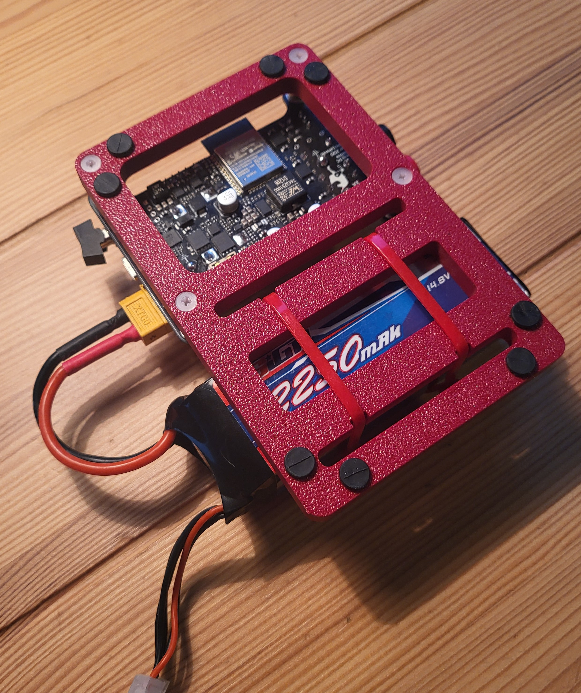

# Portable-Programmable-DC-Power-Supply
A portable version of a DC adjustable bench supply which uses a lithium-ion battery with ntuitive user controls and displays on the PCB surface.

  
  &nbsp;&nbsp;
  

# Project overview
This project was done in the context of Polytechnique Montreal's ELE3000 course which is a third-year personnal project course. The idea was to replicate an ajustable DC bench supply with similar spes, but in a very different format. DC lab supplies are often heavy and use AC power. With a somewhat solid background in power electronics, being convinced that an alternative to these supplies was possible, I chose to design a portable version, which would be comprised PCB and an external battery.

The project is was comprised of three design steps :
- The design of a 4-layer PCB using Altium Designer;
- 3D-modeling of a support using SolidWorks;
- Writing embedded firmware for the ESP32 on-board microcontroller;

  
  &nbsp;&nbsp;
  
  &nbsp;&nbsp;
  

The central feature of this project is the DC/DC conversion happening with the [TPS55287](https://www.ti.com/lit/ds/symlink/tps55287.pdf) from Texas Instruments, which is a 4-A Buck-Boost Converter with I2C Interface. Essentialy, the firmware written on the ESP32 executes a state machine where the controller polls the different sensors and signals (external ADC's, other IC pins, switches, etc) and determines in what state the board should operate. It then sends target voltage and target current limit values to the voltage converter which steps up of steps down the battery voltage to supply any downstream device connected to the board. The following image of the bottom of the PCB gives an idea as to what each part of the circuit does using the PCB schematic sheet names. 

  

  

Here's a feature/specs list for the project as a whole :
- 9.6V to 21.0V DC input voltage (battery);
- 3V to 20V DC output voltage;
- 3A max output current for 60W peak operation;
- Overvoltage, undevoltage, reverse-polarity and inrush current input protections ([LM74800](https://www.ti.com/lit/ds/symlink/lm7480-q1.pdf));
- Input on/off switching with rocker-switch;
- 80% global power efficiency at high loads with step-down operation;
- 90% global power effieciency at high loads with step-up operation;
- Reverse current, overcurrent and short-circuit output protections ([TPS259470](https://www.ti.com/lit/ds/symlink/tps25947.pdf));
- User adjustable voltage target and current limit with potentiometers;
- Output on/off switching with rocker-switch;
- Two ADC IC's for potentiometer reads, voltage and current measurements ([ADS1015](https://www.ti.com/lit/ds/symlink/ads1015.pdf));
- 7-segment displays with dedicated LED driver IC's ([LP5024](https://www.ti.com/lit/ds/symlink/lp5024.pdf));

  

The different integrated circuits present on the board communication via I2C. The following image shows the I2C bus as it is routed on the PCB.

  

For the final project poster, which was used as visual support for the final project demo, or the PCB schematics and project report (report is in French), see [Documentation](https://github.com/justinlalonde/Portable-Programmable-DC-Power-Supply/tree/50b5dae2a2250634cf91fb3bcf46d55140ee1e9c/Documentation).

