# Portable-Programmable-DC-Power-Supply
A portable version of a DC adjustable bench supply which uses a lithium-ion battery with ntuitive user controls and displays on the PCB surface.

  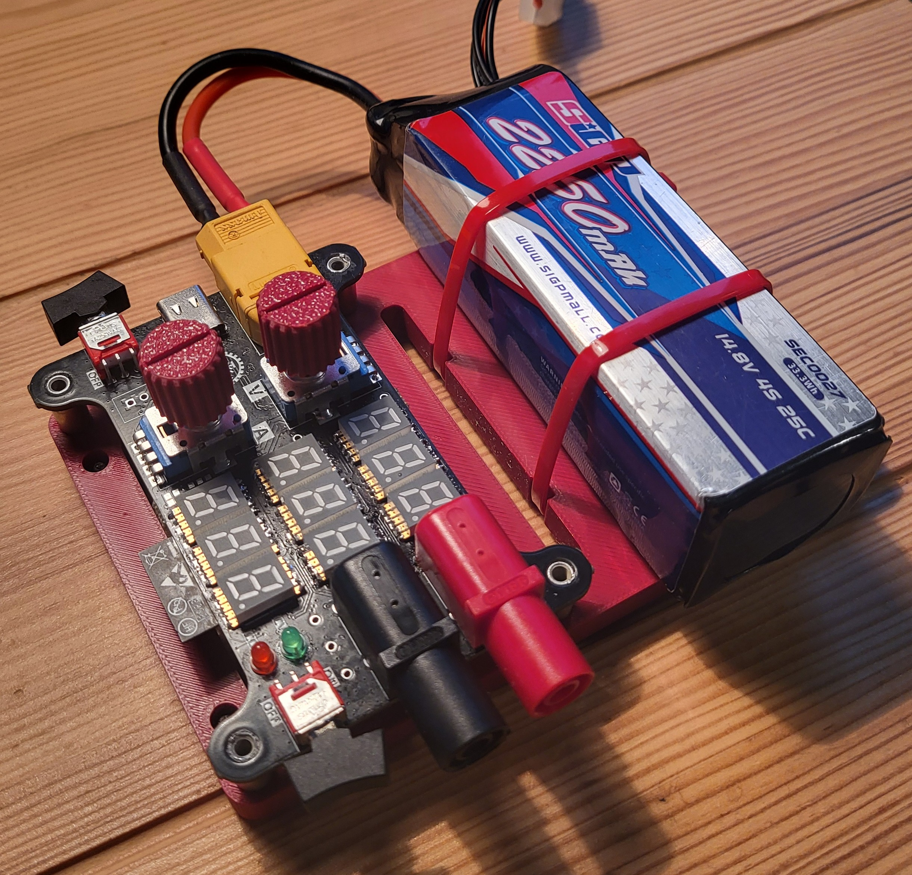
  &nbsp;&nbsp;
  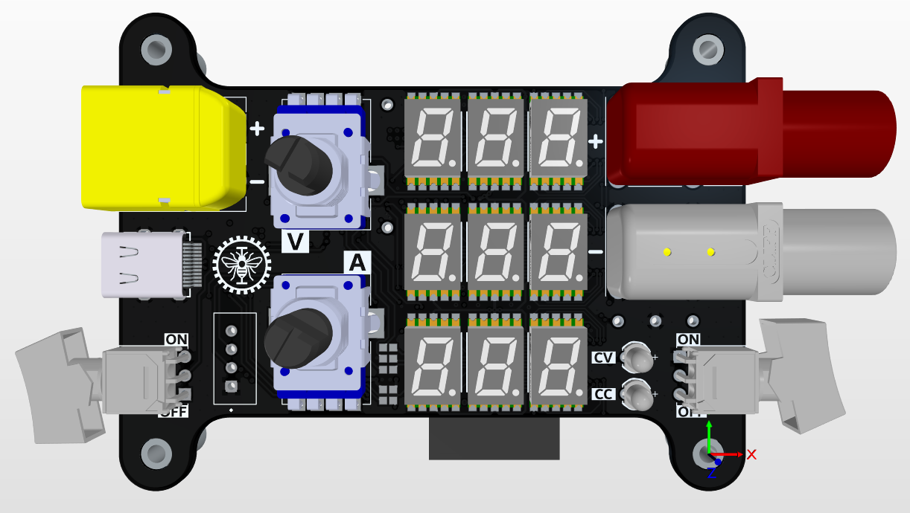

# Project overview
This project was done in the context of Polytechnique Montréal's ELE3000 course which is a third-year personnal project course. The idea was to replicate with similar specs an ajustable DC bench supply that you'd find at an electronics workbench. Bench DC supplies are often heavy and use AC power and with a somewhat solid background in power electronics, I was convinced that an alternative to these supplies was possible using a different approach. I chose to design a portable version, which would be consist of a PCB and an battery.

The project consisted of three main design steps :
- Designing of a 4-layer PCB using Altium Designer;
- THe 3D-modeling of a support using SolidWorks which would then be 3D printed;
- Writing the embedded firmware for the ESP32 microcontroller that would operate the hardware;

  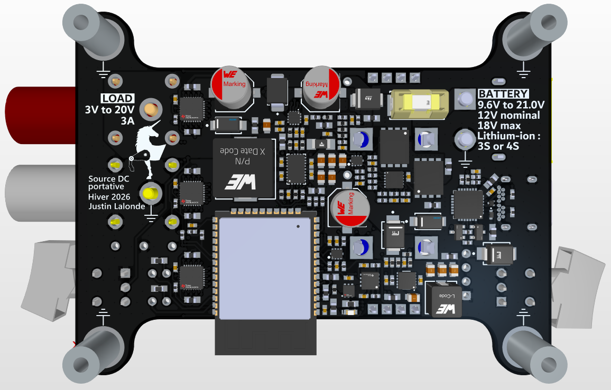
  &nbsp;&nbsp;
  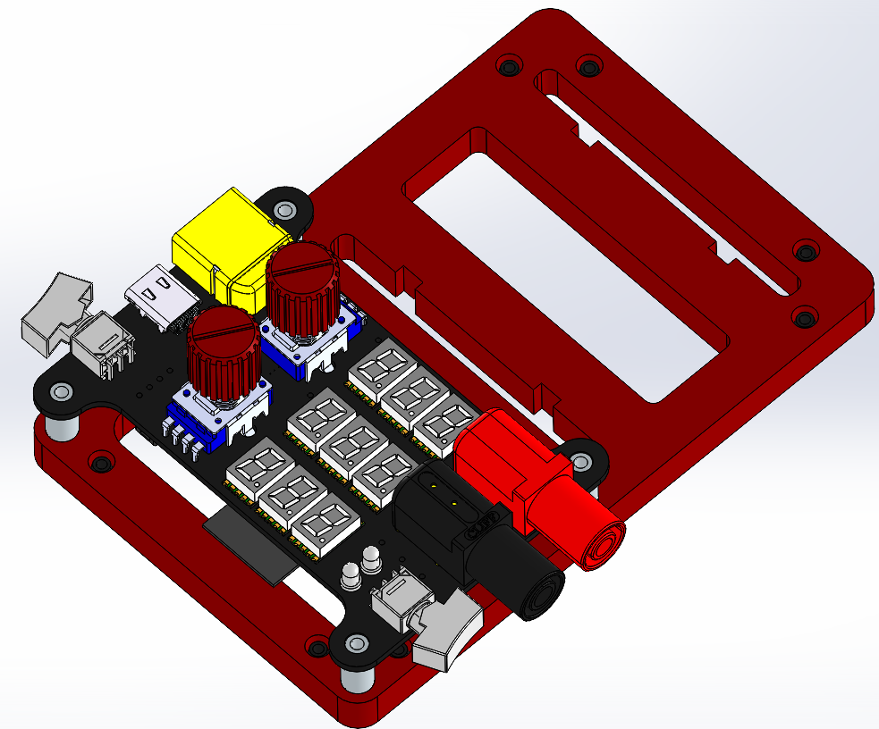
  &nbsp;&nbsp;
  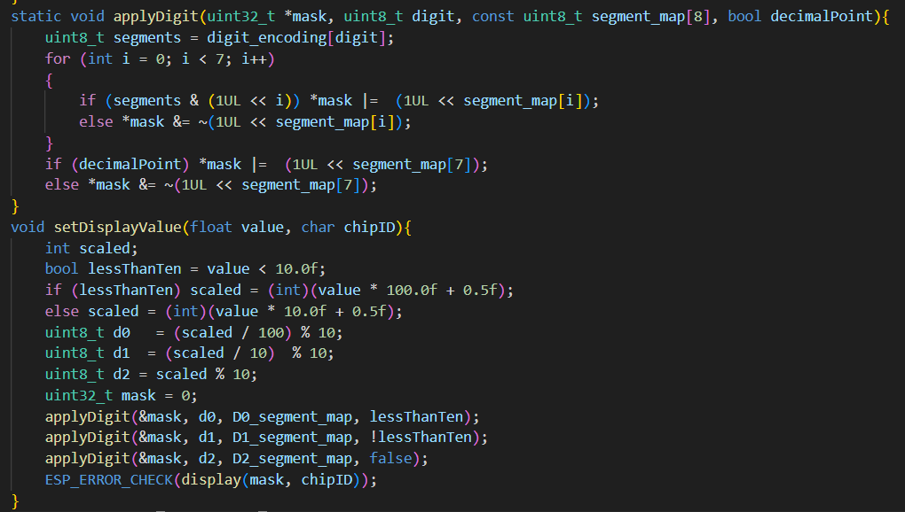

This personnal project allowed me to build on my already solid PCB design skills (see my previous [Robot PCB project](https://github.com/justinlalonde/MachinePM---Robot-PCB/tree/main)) and made me realize the balance to be found between miniaturization and functionnality when designing power electronics. The project ended with a presentation in front of professors and various evaluators. The poster used as visual support for this presentation can be found under [Documentation](https://github.com/justinlalonde/Portable-Programmable-DC-Power-Supply/tree/004b28a5eb4e6ffac3d20e264f36d698339840a9/Documentation) (poster is in French).

# Key features
Here are the key features and specs related to this project :
- 9.6V to 21.0V DC input voltage (3S or 4S lithium-ion batteries);
- 3V to 20V DC output voltage;
- 3A max output current for 60W peak operation;
- Overvoltage, undevoltage, reverse polarity and inrush current input protections ([LM74800](https://www.ti.com/lit/ds/symlink/lm7480-q1.pdf));
- Input on/off switching with rocker-switch;
- 80% global power efficiency at high loads in step-down (buck) operation;
- 90% global power effieciency at high loads in step-up (boost) operation;
- Reverse current, overcurrent and short-circuit output protections ([TPS259470](https://www.ti.com/lit/ds/symlink/tps25947.pdf));
- User-adjustable voltage and current limit targets with potentiometers;
- Output on/off switching with rocker-switch;
- 7-segment displays for voltage, current and power with dedicated LED driver IC's ([LP5024](https://www.ti.com/lit/ds/symlink/lp5024.pdf));

  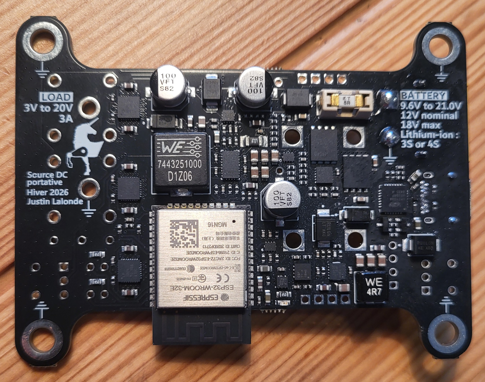
  &nbsp;&nbsp;
  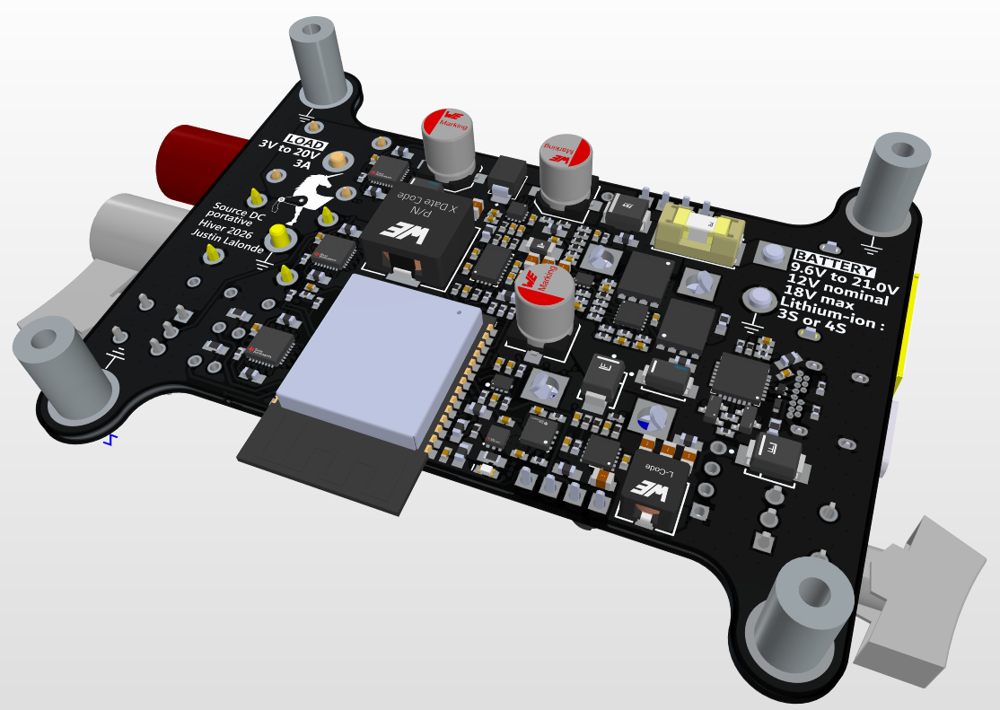

# Hardware architecture
The central feature of this project is the DC/DC conversion happening with the [TPS55287](https://www.ti.com/lit/ds/symlink/tps55287.pdf), which is a 4-A Buck-Boost Converter with I2C Interface from Texas Instruments. This IC converts the input battery voltage to a wide output voltage range using either step-up or step-down operation. This main voltage conversion IC  is only amongst the 11 subcircuits.

  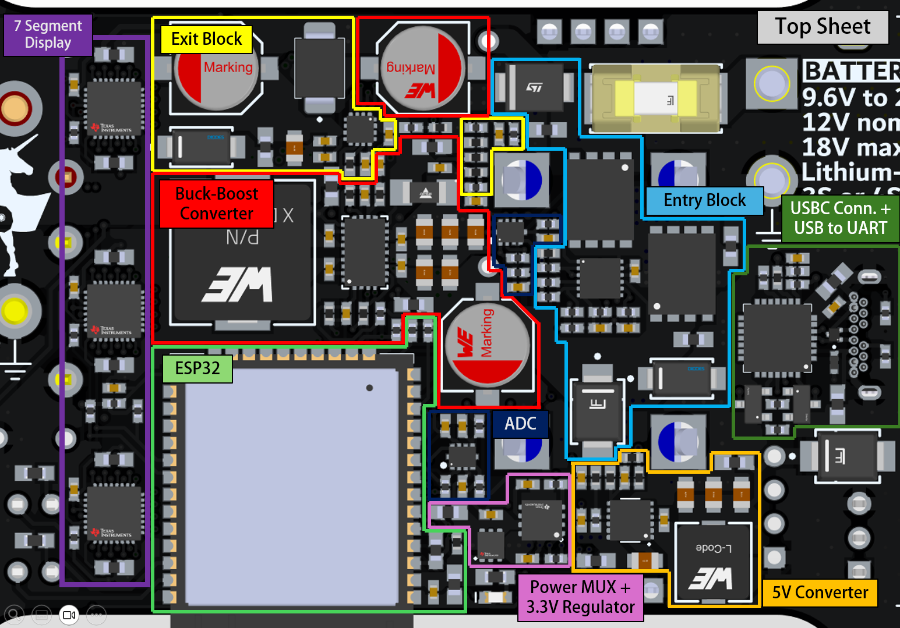

POWER STAGES :
1. The input voltage from the connected DC power supply (battery) first goes through an Input protection / switching stage. This input stage implements undervoltage and overvoltage lockouts, inrush current limiting and enable the rocker switch to disable power supply to the rest of the board (LM74800);
2. The input voltage is then directed to an independant 5V buck converter ([LMR51450](https://www.ti.com/lit/ds/symlink/lmr51440.pdf)) as well as the main buck/boost converter which converts it to an arbitrary, user-selected DC voltage target from 3V to 20V.

DIGITAL IC's :

The different integrated circuits present on the board communication via I2C. The following image shows the I2C bus as it is routed on the PCB.

  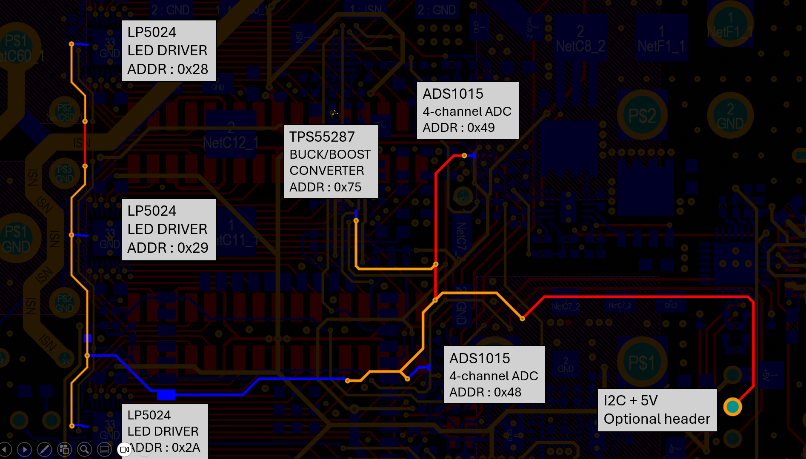

# Output fault response

  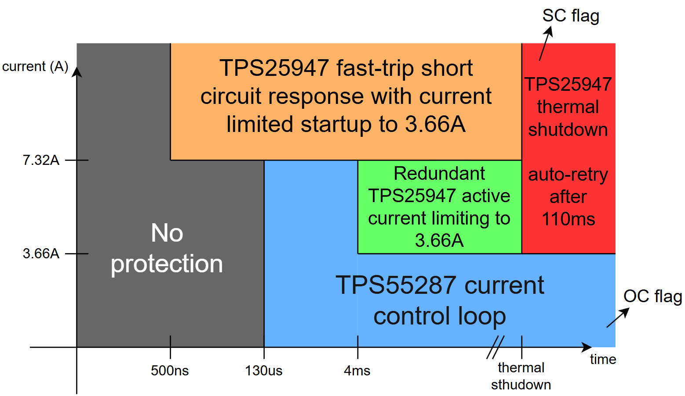

# Firmware
Essentialy, the firmware written on the ESP32 executes a state machine where the controller polls the different sensors and signals (external ADC's, other IC pins, switches, etc) and determines in what state the board should operate. It then sends target voltage and target current limit values to the voltage converter which steps up of steps down the battery voltage to supply any downstream device connected to the board.

  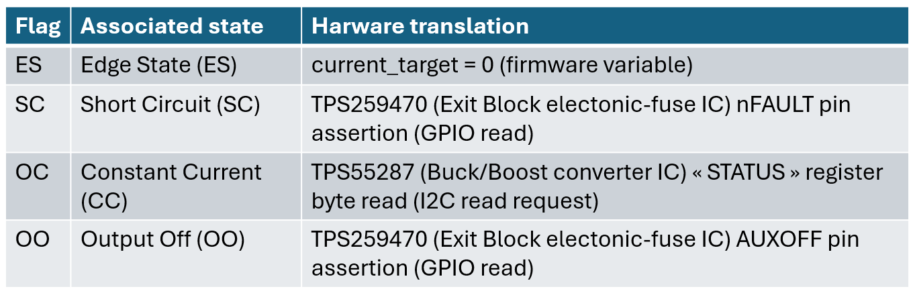

  

# Testing

  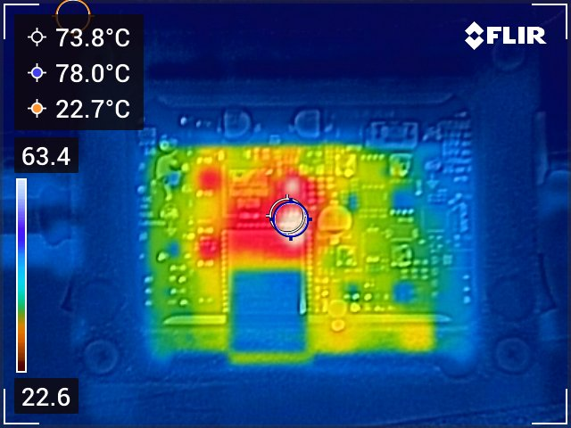

  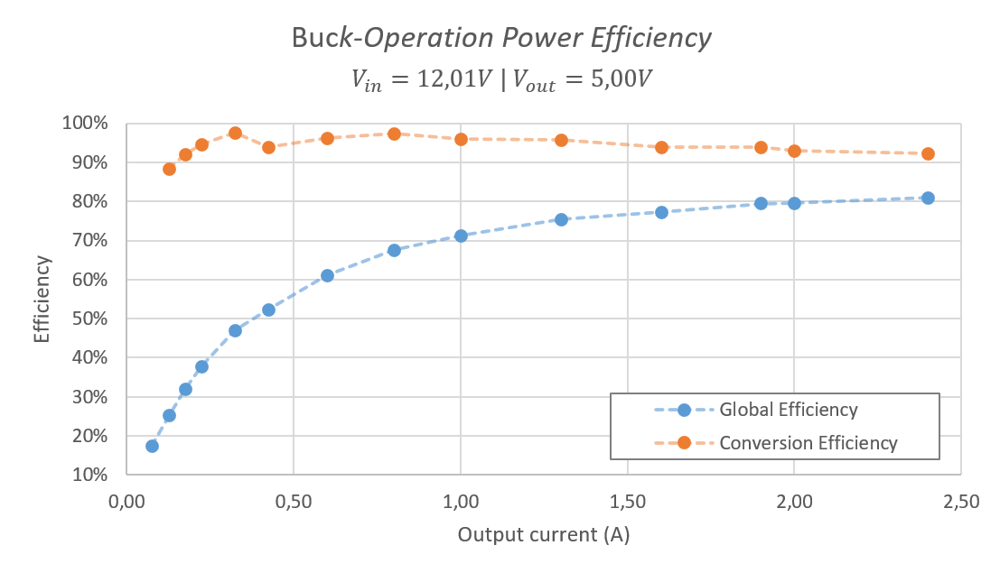
  &nbsp;&nbsp;
  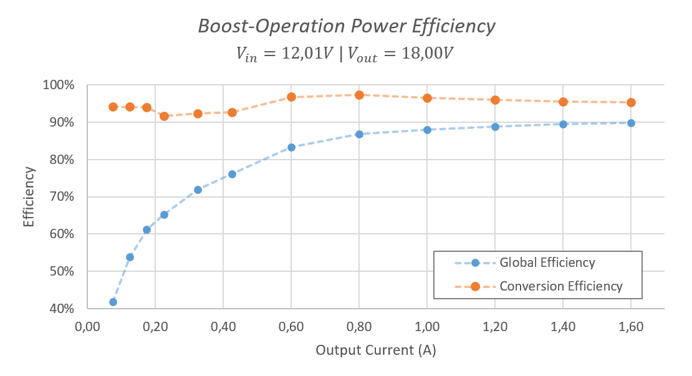

# Documentation 
For the final project poster, which was used as visual support for the final project demo, or the PCB schematics and project report (report is in French), see [Documentation](https://github.com/justinlalonde/Portable-Programmable-DC-Power-Supply/tree/50b5dae2a2250634cf91fb3bcf46d55140ee1e9c/Documentation). For the full ESP32 embedded C code, see [Firmware](https://github.com/justinlalonde/Portable-Programmable-DC-Power-Supply/tree/d0015435451c163994e33e4b49d970070d409dda/Firmware) or directly download the ESP-IDF project with the [ESP-IDF Project.zip](https://github.com/justinlalonde/Portable-Programmable-DC-Power-Supply/tree/main) file. 

  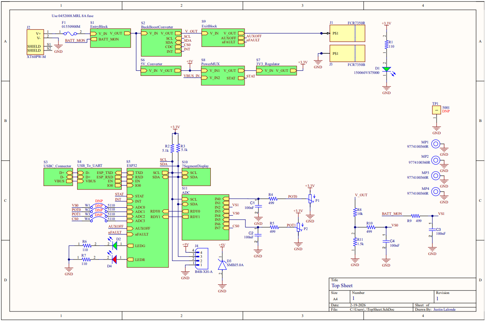

